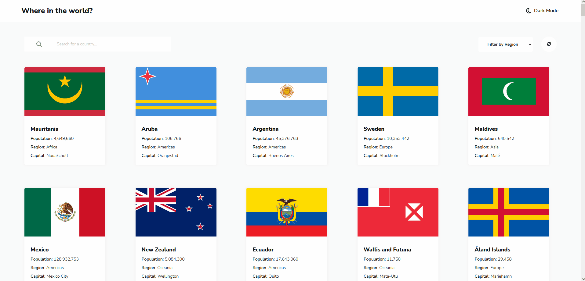
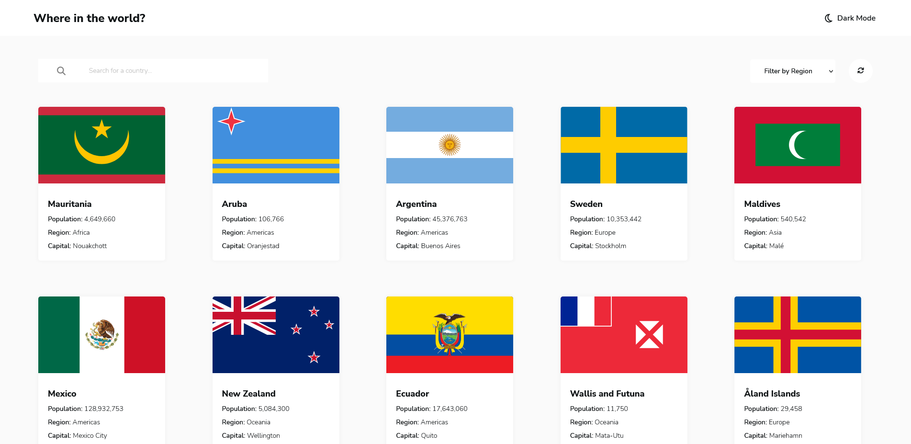
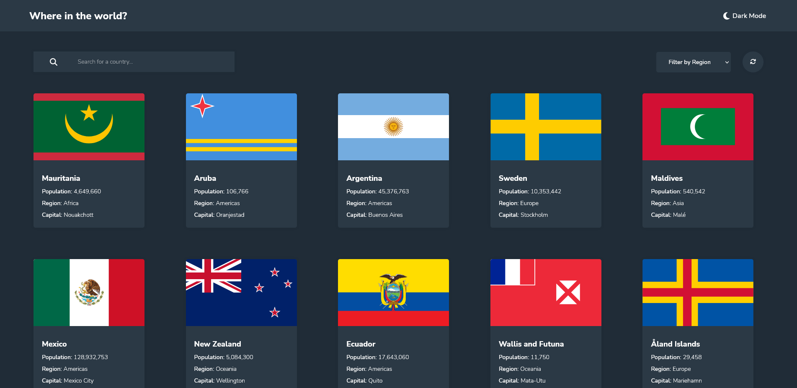
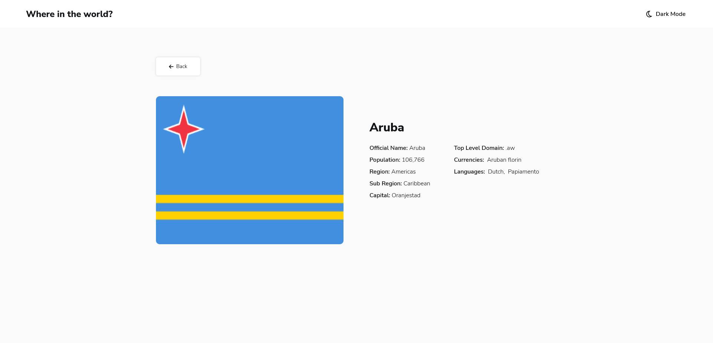
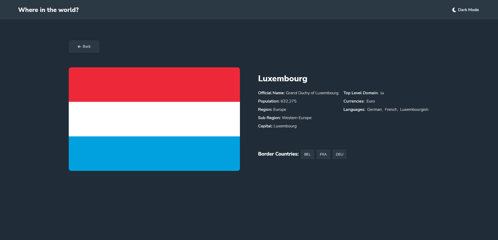
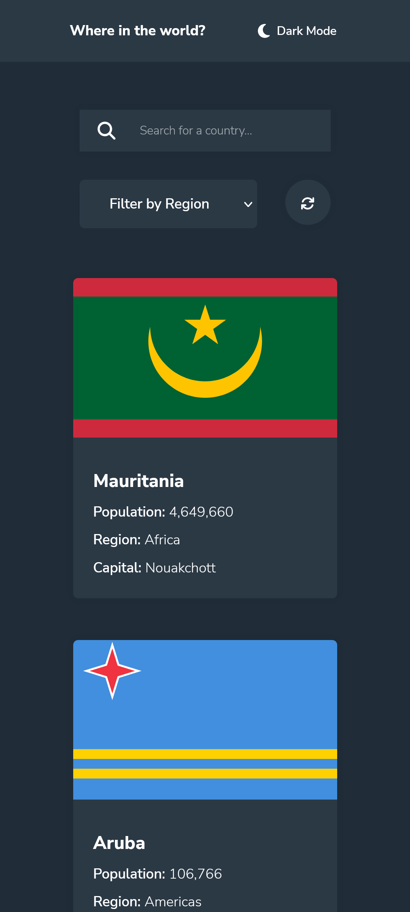
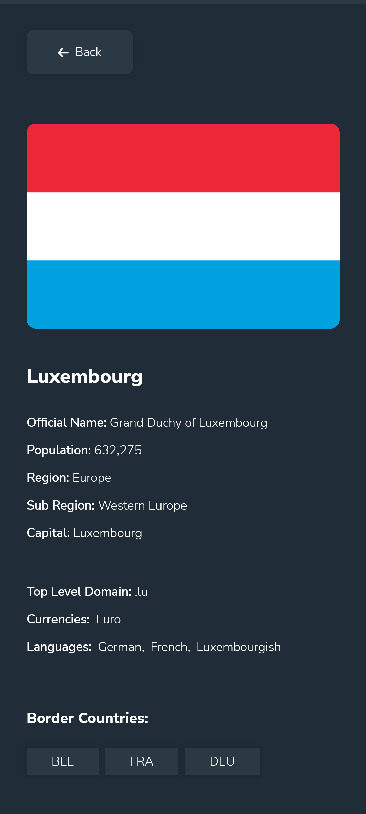

# REST Countries API with Colour Theme Switcher <!-- omit in toc -->

Challenge from [Frontend Mentor](https://www.frontendmentor.io/)

## Table of Contents <!-- omit in toc -->

- [About](#about)
- [Challenge Description](#challenge-description)
- [Technologies Used](#technologies-used)
- [Authors](#authors)
- [Challenge](#challenge)
- [Roadmap](#roadmap)
- [Demo](#demo)
- [Screenshots](#screenshots)
- [Related Projects](#related-projects)

## About

The purpose of this project was to used design files to create a website using
React that will utilise [REST Countries API](https://restcountries.com/) to
display information about countries and allow a user to search for countries and
by region

## Challenge Description

"If you're wanting to test your JavaScript skills this is the challenge for you.
Use whichever JS framework you prefer and pull data from the REST Countries
API."

## Technologies Used

## Authors

- [@haylzrandom - GitHub](https://www.github.com/haylzrandom)
- [@haylzrandom - Frontend Mentor](https://www.frontendmentor.io/profile/HaylzRandom)

## Challenge

- [REST Countries API with Colour Theme Switcher](https://www.frontendmentor.io/challenges/rest-countries-api-with-color-theme-switcher-5cacc469fec04111f7b848ca)

## Roadmap

- [x] Add theme colour picker
- [x] Add relevant error pages
- [x] Add spinner for loading data
- [ ] Add Pagination to CountryList
- [ ] Sort styling of drop down region selector
- [ ] Reset region filter value when user search for a country
- [ ] Implement use of Redux for state management
- [ ] Apply full accessibility once researched more

## Demo

## Screenshots

 
    <table>
        <thead>Desktop</thead>
        <tr>
            <td>
                
            </td>
            <td>
                
            </td>
        </tr>
        <tr>
            <td>
                
            </td>
            <td>
                
            </td>
        </tr>
    </table>

    <table>
        <thead>Mobile</thead>
        <tr>
            <td>
                
            </td>
            <td>
                
            </td>
        </tr>
    </table>

## Related Projects

Here are some other challenges I have completed from Frontend Mentor

- [Space Tourism Multipage Website](https://github.com/HaylzRandom/space-tourism-multipage-website)
- [Calculator App](https://github.com/HaylzRandom/calculator-app)
- [Advice Generator App](https://github.com/HaylzRandom/advice-generator-app)
- [Testimonials Grid Section](https://github.com/HaylzRandom/testimonials-grid-section)
- [Single Price Grid Component](https://github.com/HaylzRandom/single-price-component)
